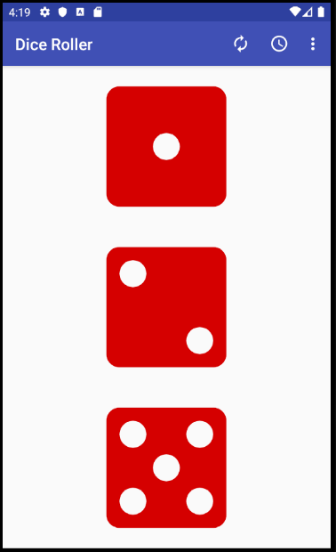
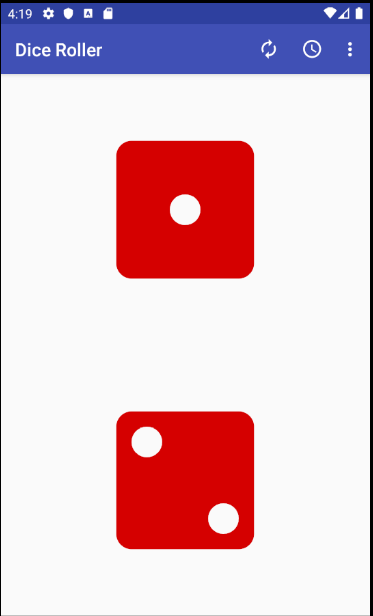
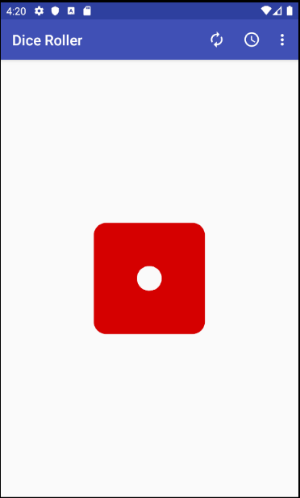
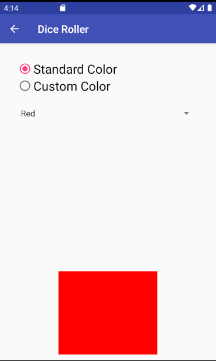
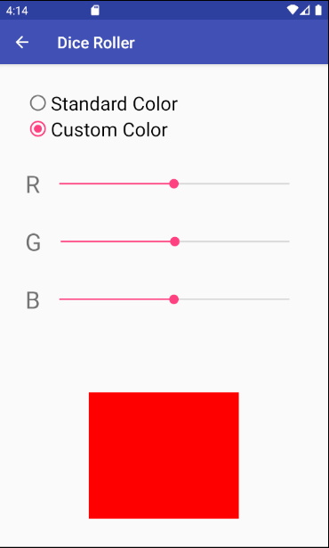
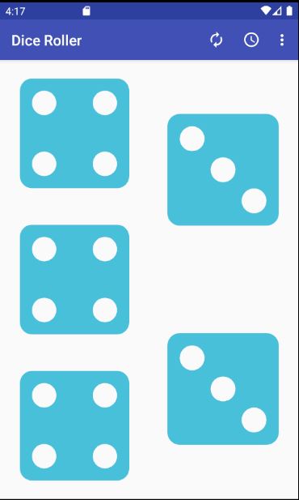
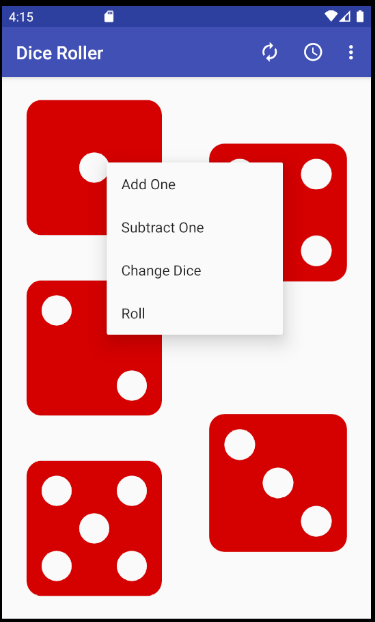
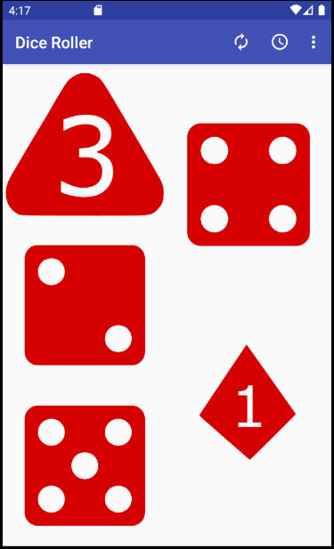

## Dice Roller App
An application created using an MVC architectural design that allows user to control a max number of 6 dices.
The user has the ability to control each dice individually allowing them to add or subtract each dice and change the layout
and color of said dices. 

## Repo location
https://github.com/jlinares1/Dice_Roller_App.git

## Software

* Android Studios 

### Content

  

### Transitions between dices

 
    

### Dice color changer 

 

### Add One - Subtract One - Change dice

  
